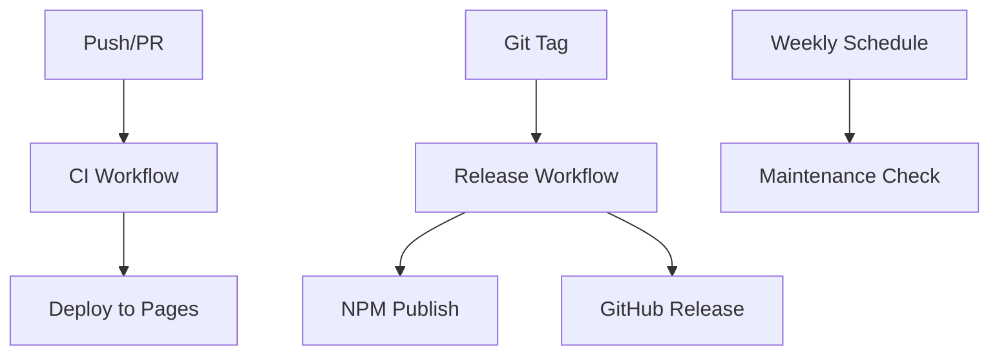

# GitHub Actions CI/CD Workflows

This directory contains GitHub Actions workflows for automated testing, building, and deployment of JDOM.js.

## 🚀 Workflows Overview

### [`ci.yml`](./ci.yml) - Continuous Integration

**Triggers:** Push to main branches, Pull requests
**Purpose:** Quality assurance and testing

-   ✅ **Linting & Formatting** - Ensures code style consistency
-   🧪 **Multi-Node Testing** - Tests on Node.js 16, 18, 20
-   🏗️ **Build Verification** - Validates production builds
-   🔒 **Security Audit** - Checks for vulnerabilities

### [`release.yml`](./release.yml) - Release Management

**Triggers:** Git tags (v*.*.\*)
**Purpose:** Automated publishing and releases

-   📦 **NPM Publishing** - Automated package publishing
-   📋 **GitHub Releases** - Creates detailed release notes
-   ✅ **Release Validation** - Full test suite before publishing

### [`deploy.yml`](./deploy.yml) - GitHub Pages Deployment

**Triggers:** Push to main branch, Manual dispatch
**Purpose:** Demo site deployment

-   🌐 **Live Demo** - Deploys interactive demo to GitHub Pages
-   📱 **Test Suite** - Includes browser-based test runner
-   🎯 **Examples** - Showcases library features

### [`maintenance.yml`](./maintenance.yml) - Automated Maintenance

**Triggers:** Weekly schedule (Mondays 9 AM UTC), Manual dispatch
**Purpose:** Project health monitoring

-   🔍 **Dependency Audits** - Weekly security checks
-   📊 **Health Monitoring** - Bundle size, performance metrics
-   🎨 **Code Quality** - Formatting and linting verification
-   🚨 **Issue Creation** - Auto-creates issues for problems

## 🔧 Required Secrets

To use these workflows, configure the following secrets in your repository:

### Production Secrets

-   `NPM_TOKEN` - NPM authentication token for publishing
    -   Create at: https://www.npmjs.com/settings/tokens
    -   Type: "Automation" token
    -   Required for: `release.yml`

### Optional Secrets

-   `GITHUB_TOKEN` - Automatically provided by GitHub Actions
    -   Used for: Creating releases, issues, and Pages deployment

## 🎯 Workflow Dependencies



## 📋 Badge Status

Add these badges to your README.md:

```markdown
[](https://github.com/higginsrob/jdom/actions/workflows/ci.yml)
[](https://github.com/higginsrob/jdom/actions/workflows/release.yml)
[](https://github.com/higginsrob/jdom/actions/workflows/deploy.yml)
```

## 🚀 Release Process

1. **Development** - Work on feature branches
2. **Pull Request** - CI runs automatically
3. **Merge to Main** - Deploy workflow updates demo site
4. **Create Tag** - `git tag v1.2.3 && git push origin v1.2.3`
5. **Automated Release** - NPM publish + GitHub release

### [`fix-lockfile.yml`](./fix-lockfile.yml) - Lock File Maintenance

**Triggers:** Manual dispatch only
**Purpose:** Fix package-lock.json sync issues

-   � **Lock File Regeneration** - Fixes npm ci sync issues
-   📝 **Automated PR Creation** - Creates PR with fixes
-   ✅ **Verification** - Tests that changes work correctly

## �🛠️ Manual Triggers

All workflows support manual triggering via `workflow_dispatch`:

```bash
# Trigger maintenance check
gh workflow run maintenance.yml

# Trigger deployment
gh workflow run deploy.yml

# Fix lock file sync issues (creates PR)
gh workflow run fix-lockfile.yml
```

## 📈 Monitoring

-   **Security**: Weekly automated audits
-   **Performance**: Bundle size tracking
-   **Quality**: Automated formatting and linting
-   **Health**: Multi-Node.js version testing
